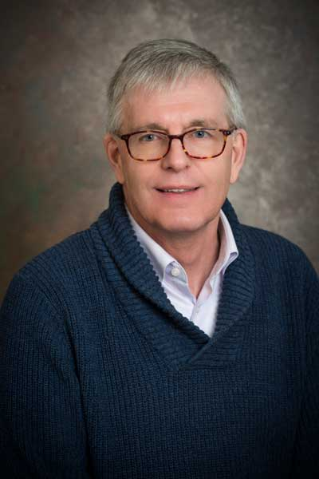

---
build:
  list: always
  publishResources: true
  render: always
title: "Rudolf Eigenmann"
weight: 1
---

## Title
Developing an RSE Workforce for Accelerating Computational, Data, and AI Applications 

## Abstract
I will describe our DARSE (Democratizing Access to Research Software Engineering) project - a SCIPE award, whose goal is the creation of a team of Research Software Engineers (RSE) and an educational RSE pipeline. Among the DARSE challenges is the assembly of RSE best practices and the identification of science projects that can use our RSE support and, in this way, amplify the project impact. I will also describe the application of RSE lessons learned in a range of projects, such as the Atom Portal - a CSSI project,  the University of Delaware AI Center of Excellence, and the ICICLE NSF AI Institute. 

## Bio

Dr. Rudolf (Rudi) Eigenmann is a Distinguished Professor of Electrical and Computer Engineering at the University of Delaware. His core research interests include optimizing compilers, programming methodologies, tools, and performance evaluation for high-performance computing, as well as the design of cyberinfrastructure. The use of AI methods and tools has become a recent focus on all his research activities. 